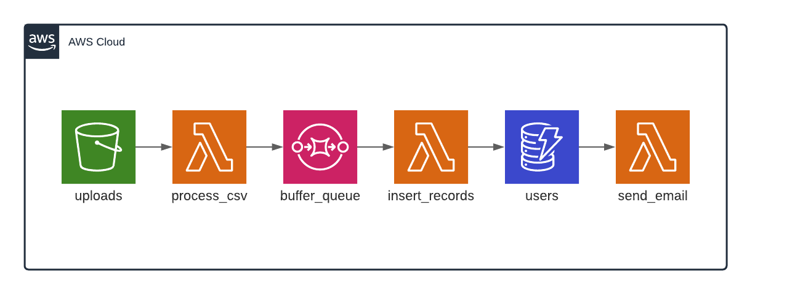

# event-driven-architecture-example

Event-driven architecture example with Terraform, AWS and Nodejs

## Architecture

## Important

[Verify an email address](https://docs.aws.amazon.com/ses/latest/DeveloperGuide/verify-email-addresses-procedure.html) so SES works.

## Setup

`chmod +x ./deploy.sh`

`chmod +x ./destroy.sh`

Inside `infrastructure/main.tf` update the value for `from_email` and `name` inside `locals`.

## Run

`npm start`

## Deploy

`npm run deploy`

## Destroy

`npm run destroy`

## How to play

- Update the provided [csv file](test.csv) from the repo by adding/editing entries.
- Upload it to the S3.
- Wait a few seconds until you get an email.